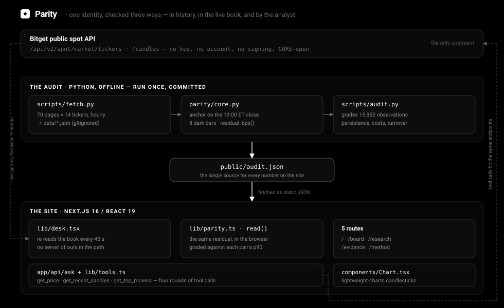

# Parity

**A pre-trade check on Bitget's overnight rToken quotes, against the identities they are required to satisfy.**

SOXL is contractually built to deliver three times the return of SOXX. SOXS delivers minus three times the same index. Measured from a common anchor over a single session, that is not a forecast — it is arithmetic. While a US venue is open, rToken orders route to NYSE and Nasdaq and arbitrage holds it together. Between **20:00 and 04:00 ET** nothing does: each leg is quoted independently by a market maker, and they stop agreeing.

A leveraged ETF that is not moving at its stated multiple is not a prediction that someone is wrong. It is a **proof** that someone is. The arithmetic does not say which one.

**Live:** https://parity-audit.vercel.app
**Built for:** [Bitget AI Base Camp Hackathon S2](https://bitget-ai.gitbook.io/bitgetai_hackathons2) — AI Trading Desk, Execution Assistance
**The audit:** 15,852 hourly observations · 14 identities · ~179 nights in 2026 · **24.8% break by more than 20 bps**

---

## Features

### Core Capabilities

- **Identities, not models** — 14 relationships whose multiple is set in an issuer's prospectus, not estimated by us. There is no fair value to argue about and no parameter to tune.
- **Graded against its own night** — A reading is scored against the p90 that *this pair* actually produces in the dark, not against a universal threshold. rSOXS/rSOXX breaks 20 bps on 59.5% of nights; rQLD/rQQQ on 7.0%. One number for both would be useless.
- **The cost of acting on it** — Every breach is priced. Holding $1 of the leg against $|β| of the base is `1+|β|` gross dollars per dollar of signal, charged twice: 80 bps round trip on a 3× pair, 40 on a mirror, at 10 bps a side.
- **The trade we did not find** — We entered every reading past 40 bps and held to the open. **Every net-of-cost column is negative.** That finding is the product: these are defects you pay, not opportunities you take.
- **The stale-print objection, answered** — Median turnover inside wide bars equals or exceeds quiet bars on 13 of 14 pairs. Real quotes, real volume, genuinely inconsistent.
- **Live analyst with real hands** — Three tools wired to Bitget's market API. It is instructed never to answer a price question from memory, and the chips above each reply name the call it made.
- **No backend in the hot path** — The board re-implements the same residual in the browser and reads Bitget directly. Nothing of ours sits between you and the venue.

### The Site

- **Live board** — Every identity ranked by how far it has drifted, re-read every 45 seconds, with the arithmetic and an 8-bar histogram of where in the night that pair usually breaks.
- **Research desk** — A candlestick chart on any rToken or spot symbol, and an analyst you can ask anything from "what's the price of SOL" to "what's breaking tonight".
- **Evidence** — Four tables, one argument, and the raw `audit.json` behind every figure.
- **Method** — What is measured, how, and where it stops being true — including why the control is weak.

---

## Architecture

<p align="center">
  
</p>

Parity has one upstream — Bitget's public spot API — and reaches it three different ways.

### Layer 1: The audit (Python, offline)

Run once; the output is committed. Pulls 70 pages of hourly candles for the tickers the identities touch, anchors each night on the 19:00 ET close, walks the eight dark bars, and grades every one:

- `parity/core.py` owns the **20:00 → 04:00 ET** boundary, `dark_bars()`, `session_bars()` (the 10:00–16:00 control) and `residual_bps()`.
- `parity/universe.py` declares the identities as data — `LEVERAGE`, `MIRRORS`, `WRAPPERS` — each with the multiple its prospectus fixes.
- `scripts/audit.py` scores persistence, turnover and cost, and writes `public/audit.json`.

### Layer 2: `public/audit.json`

One file. Every figure on the site comes from it; nothing is computed server-side at request time. `scripts/readme.py` regenerates the tables in this document from that same file, so the README cannot drift from the data.

### Layer 3: The site (Next.js, browser)

`lib/parity.ts` re-implements `read()` — the same residual, in TypeScript — and `lib/desk.tsx` polls Bitget directly from the page. Bitget serves `access-control-allow-origin: *`, so **the live board has no server of ours at all**.

One server route exists: `app/api/ask`, which holds the model key and runs the tool loop. Without a key the board, the evidence and the method are unaffected.

### Data Flow

```
Audit (offline, once)                        Board (browser, live)
     │                                              │
     ├─ fetch.py ── 70 pages × 14 tickers           │
     ├─ anchor  = close of the 19:00 ET bar         │
     ├─ dark    = the 8 bars from 20:00             │
     ├─ session = 10:00–16:00, the control          │
     │                                              │
     ├─ residual_bps = (r_leg − β·r_base) × 1e4     │
     ├─ persistence at +1h, +2h, +3h, to the open   │
     ├─ turnover split by |residual|                │
     ├─ cost = 2 × fee × (1 + |β|)                  │
     │            │                                 │
     │            └─► public/audit.json ───────────►├─ load the audit
     │                                              ├─ darkWindow(now)
     │                                              ├─ GET /spot/market/tickers
     │                                              ├─ GET /candles → anchor per leg
     │                                              ├─ read() → the same residual
     │                                              └─ grade vs THIS pair's dark_p90
     │                                                       │
     │                             POST /api/ask ◄───────────┘  the analyst
     │                                   │
     │                                   ├─ round 1..4: the model may call a tool
     │                                   ├─ get_price · get_recent_candles · get_top_movers
     │                                   └─ each tool hits the SAME Bitget endpoints
```

---

## The Identity

A leveraged ETF is built to deliver a fixed multiple of its index's **daily** return. Anchor both legs at the same instant inside one session and the daily reset becomes irrelevant — what is left is one line:

```
r_leg  =  beta * r_base

residual_bps  =  ( r_leg  -  beta * r_base ) * 10,000
```

Where `r = price / anchor - 1`, and `anchor` is the close of the **19:00 ET bar** — the last print of the 20:00 session close.

Everything left over is the residual. It carries no view about where anything is going. It says only that two prices the venue is publishing at the same moment cannot both be right.

### The 14 relationships

| Kind | Count | Why it must hold | Tolerance |
|------|-------|------------------|-----------|
| **Leverage** | 9 | The issuer's prospectus fixes the multiple — 3×, −3×, 2× | Tight |
| **Mirror** | 4 | Bull and bear 3× products over the *same* index: `r_bull = −r_bear` | Tight, and cheapest to express |
| **Wrapper** | 1 | SMH and SOXX wrap near-identical baskets, so β = 1 | Wider — basket drift is real |

Mirrors are the interesting case. Both legs are the sloppily quoted end of the book, which is where the error lives, and hedging them is equal-notional rather than one-against-three — so they cost half as much to act on.

---

## What We Measured

**15,852 hourly observations** across ~179 nights in 2026, over 14 identities.

**24.8% of them sit more than 20 basis points outside the identity.** The widest single reading was **668 bps**.

### 01 · The overnight book is new

An identity can only be checked when both legs are actually quoted. Share of the 8 nightly bars with a real print:

**2023: 0.0%**, **2024: 0.0%**, **2025: 31.0%**, **2026: 82.3%**

Before 2025 the dark window is empty, which is why the study starts where it does — and why nobody has audited this yet.

### 02 · How often each identity breaks

| pair | required | kind | nights | session p50 | dark p50 | dark p90 | >20 bps | p99 | worst |
|---|---|---|---|---|---|---|---|---|---|
| rSOXL/rSOXX | 3.0× | leverage | 179 | 10.5 | 19.4 | 65 | **48.8%** | 242 | 481 |
| rSQQQ/rQQQ | -3.0× | leverage | 180 | 4.9 | 7.8 | 23 | **13.8%** | 154 | 258 |
| rTQQQ/rQQQ | 3.0× | leverage | 183 | 3.4 | 4.9 | 17 | **8.2%** | 172 | 314 |
| rSPXU/rSPY | -3.0× | leverage | 177 | 6.2 | 8.3 | 24 | **14.6%** | 73 | 129 |
| rSOXS/rSOXX | -3.0× | leverage | 179 | 22.8 | 25.6 | 87 | **59.5%** | 244 | 330 |
| rTNA/rIWM | 3.0× | leverage | 177 | 7.2 | 8.1 | 22 | **14.5%** | 66 | 507 |
| rTZA/rIWM | -3.0× | leverage | 177 | 14.2 | 15.4 | 43 | **37.5%** | 107 | 150 |
| rSQQQ/rTQQQ | -1.0× | mirror | 180 | 5.8 | 5.7 | 18 | **8.6%** | 181 | 226 |
| rSMH/rSOXX | 1.0× | wrapper | 180 | 13.5 | 12.2 | 38 | **30.4%** | 108 | 179 |
| rTZA/rTNA | -1.0× | mirror | 177 | 16.0 | 14.2 | 39 | **34.9%** | 125 | 482 |
| rSOXS/rSOXL | -1.0× | mirror | 184 | 23.6 | 19.9 | 73 | **49.8%** | 454 | 668 |
| rUPRO/rSPY | 3.0× | leverage | 177 | 9.8 | 6.0 | 18 | **8.5%** | 71 | 81 |
| rQLD/rQQQ | 2.0× | leverage | 177 | 7.5 | 4.1 | 15 | **7.0%** | 49 | 64 |
| rSPXU/rUPRO | -1.0× | mirror | 177 | 11.2 | 6.1 | 22 | **12.4%** | 99 | 157 |

**Session** is the same arithmetic measured between 10:00 and 16:00 ET, when arbitrage is live. Treat it as a floor on measurement noise rather than a clean control: hourly closes on two instruments in a fast market are not simultaneous, and that manufactures residual of its own. For a few pairs the session therefore reads *wider* than the night.

The headline is the **absolute breach rate**, which does not depend on the control being clean.

### 03 · The trade we did not find

If a breach closed by morning it would be an arbitrage. We entered every reading past 40 bps and held to the 04:00 open. Capture is what the breach gave back; cost is two sides of taker fee on gross notional — four dollars working per dollar of signal on a 3× pair, two on a mirror.

| pair | +1h | +3h | to the open | n | costs | net |
|---|---|---|---|---|---|---|
| rSOXL/rSOXX | +14.9 | +16.0 | +16.4 | 204 | −80 | **-63.6** |
| rSQQQ/rQQQ | +3.0 | -0.7 | -3.3 | 21 | −80 | **-83.3** |
| rTQQQ/rQQQ | +7.1 | +8.8 | +9.3 | 32 | −80 | **-70.7** |
| rSPXU/rSPY | +3.8 | +3.7 | +0.7 | 42 | −80 | **-79.3** |
| rSOXS/rSOXX | +28.0 | +30.9 | +32.7 | 306 | −80 | **-47.3** |
| rTNA/rIWM | +5.7 | +6.9 | +8.7 | 16 | −80 | **-71.3** |
| rTZA/rIWM | +23.2 | +20.7 | +23.6 | 104 | −80 | **-56.4** |
| rSQQQ/rTQQQ | -0.7 | -1.7 | -2.1 | 21 | −40 | **-42.1** |
| rSMH/rSOXX | +6.4 | +6.8 | +8.9 | 83 | −40 | **-31.1** |
| rTZA/rTNA | +24.1 | +24.9 | +30.0 | 87 | −40 | **-10.0** |
| rSOXS/rSOXL | +29.5 | +31.2 | +29.5 | 267 | −40 | **-10.5** |
| rUPRO/rSPY | +3.6 | +3.3 | +3.8 | 24 | −80 | **-76.2** |
| rQLD/rQQQ | -0.2 | -0.8 | -1.2 | 41 | −60 | **-61.2** |
| rSPXU/rUPRO | +0.9 | -4.8 | -19.7 | 16 | −40 | **-59.7** |

**Every net column is negative.** The breach is real, it is measurable, and it is not a trade.

That is the finding, not a failure to find one. These are defects you *pay*, not opportunities you take — which is exactly why Parity is a pre-trade check rather than a strategy. You do not harvest these. You avoid paying them.

### 04 · These are not stale prints

The obvious objection is that a wide reading is just an hour where one leg did not trade. Median turnover inside the leg's own bar, split by how wide the reading was:

| pair | quiet (<20 bps) | middling | wide (≥60 bps) | verdict |
|---|---|---|---|---|
| rSOXL/rSOXX | $25,717k | $29,836k | **$50,782k** | busier |
| rSQQQ/rQQQ | $5,323k | $5,211k | **$7,625k** | busier |
| rTQQQ/rQQQ | $9,236k | $7,656k | **$5,617k** | quieter |
| rSPXU/rSPY | $162k | $164k | **$407k** | busier |
| rSOXS/rSOXX | $6,219k | $6,168k | **$6,309k** | busier |
| rTNA/rIWM | $158k | $208k | **$288k** | busier |
| rTZA/rIWM | $61k | $69k | **$117k** | busier |
| rSQQQ/rTQQQ | $5,236k | $6,856k | **$9,687k** | busier |
| rSMH/rSOXX | $996k | $1,916k | **$2,902k** | busier |
| rTZA/rTNA | $65k | $63k | **$109k** | busier |
| rSOXS/rSOXL | $6,020k | $5,908k | **$8,105k** | busier |
| rUPRO/rSPY | $415k | $418k | **$468k** | busier |
| rQLD/rQQQ | $752k | $1,251k | **$883k** | busier |
| rSPXU/rUPRO | $158k | $193k | **$597k** | busier |

Wide bars are as busy as quiet ones, or busier, on **13 of 14** pairs. Real quotes, real volume, genuinely inconsistent.

---

## Technology Stack

**Audit:**
- Python 3.11+, standard library only — no pandas, no numpy
- `zoneinfo` for DST-correct ET arithmetic
- Output is a single committed JSON file

**Site:**
- Next.js 16.3.5 (App Router, Turbopack) + React 19
- TypeScript 5 (strict)
- Tailwind CSS v4 (`@theme` tokens, no config file)
- Framer Motion — page transitions, stagger, the spring nav indicator
- Lightweight Charts 4.2.3 — candlesticks
- lucide-react, clsx, tailwind-merge

**Integrations:**
- Bitget public spot v2 REST — keyless, CORS-open, called from the browser *and* from the analyst's tools
- Any OpenAI-compatible chat endpoint with tool calling

---

## Getting Started

### Prerequisites

- **Node.js 20+** and **pnpm**
- **Python 3.11+** (only to rebuild the audit; the committed `audit.json` is enough to run the site)
- No Bitget account, no API key, no signing — every endpoint used is public and read-only

### Installation

**1. Clone the repository:**
```bash
git clone https://github.com/martinvibes/parity.git
cd parity
```

**2. Install:**
```bash
pnpm install
```

### Environment Setup

The site needs **no environment variables to run**. The board, the evidence and the method all work with nothing configured.

One optional variable enables the analyst on `/research`:

```bash
# .env.local — never commit this
OPENAI_API_KEY=sk-...
```

| Variable | Default | Purpose |
|----------|---------|---------|
| `OPENAI_API_KEY` | — | Key for the analyst. Also accepted as `LLM_API_KEY` |
| `LLM_BASE_URL` | `https://api.openai.com/v1` | Any OpenAI-compatible base URL |
| `LLM_MODEL` | `gpt-4o` | Model name. Must support tool calling |

Without a key, `/api/ask` returns a clear 503 and **the rest of the site is unaffected**.

### Running

```bash
pnpm dev          # http://localhost:3000
pnpm build        # production build
npx tsc --noEmit  # typecheck
```

### Rebuilding the audit

```bash
python3 scripts/fetch.py    # hourly candles for the tickers the identities touch
python3 scripts/audit.py    # grades them, writes public/audit.json
python3 scripts/readme.py   # regenerates this README from that file
```

---

## Project Structure

```
parity/
├── parity/                            # the audit library
│   ├── bitget.py                      # public API client (no key, no signing)
│   ├── universe.py                    # the identities, as data + the multiple each prospectus fixes
│   └── core.py                        # the 20:00→04:00 boundary, dark_bars(), residual_bps()
│
├── scripts/
│   ├── fetch.py                       # cache hourly candles → data/*.json (gitignored)
│   ├── audit.py                       # grade every night → public/audit.json
│   ├── readme.py                      # regenerate this README from that file
│   ├── diag.py  probe.py  revert.py   # exploratory checks kept for reproducibility
│
├── app/                               # Next.js App Router
│   ├── page.tsx                       # landing
│   ├── board/page.tsx                 # the live board
│   ├── research/page.tsx              # chart + analyst
│   ├── evidence/page.tsx              # the four tables
│   ├── method/page.tsx                # method and limits
│   ├── api/ask/route.ts               # the analyst — key lives here, tool loop runs here
│   └── globals.css                    # the whole design system, Tailwind v4 @theme
│
├── components/
│   ├── Landing.tsx                    # hero, live proof panel, feature cards
│   ├── Navbar.tsx                     # pill nav with the spring layoutId indicator
│   ├── Chart.tsx                      # lightweight-charts candlesticks + OHLC readout
│   ├── FlashlightEffect.tsx           # cursor spotlight, desktop only
│   ├── Orbs.tsx                       # the three floating blurred orbs
│   └── ui/GlassCard.tsx               # the glass surface + shimmer sweep on hover
│
├── lib/
│   ├── time.ts                        # darkWindow() — DST-safe ET arithmetic
│   ├── bitget.ts                      # browser client + bounded-concurrency pool()
│   ├── parity.ts                      # read() — the same residual, in TypeScript
│   ├── tools.ts                       # the analyst's three tools + symbol resolution
│   ├── state.ts                       # live board → analyst context
│   ├── desk.tsx                       # the live provider, 45 s poll
│   └── animations.ts  cn.ts           # motion variants, class merging
│
└── public/audit.json                  # ⭐ the only source for every number on the site
```

---

## Routes

| Route | Page | Description |
|-------|------|-------------|
| `/` | Landing | The thesis, and the worst identity on the book right now |
| `/board` | Board | Every identity ranked by drift, with the arithmetic and the night profile |
| `/research` | Research | Candlestick chart on any symbol, plus the analyst |
| `/evidence` | Evidence | The four tables above, and the raw `audit.json` |
| `/method` | Method | What is measured, how, and where it stops being true |

---

## API Reference

### `POST /api/ask`

One question, up to four rounds of tool calls, one answer. Server-side; the model key never reaches the browser.

| Field | Type | Description |
|-------|------|-------------|
| `question` | `string` | Max 600 chars |
| `state` | `string` | The live board, as context. Max 16,000 chars |

**Response:**

```json
{
  "text": "The current price of SOL is $116.74. Over the past 24 hours, SOL is up by 0.89%.",
  "tools": [
    { "name": "get_price", "args": { "symbol": "SOL" }, "result": { "...": "..." } },
    { "name": "get_recent_candles", "args": { "symbol": "SOL", "granularity": "1h" }, "result": { "...": "..." } }
  ],
  "model": "gpt-4o"
}
```

The `tools` array is rendered in the UI as chips above each answer, so the reader can see exactly which call produced the figure.

### The analyst's tools

| Tool | Arguments | Hits |
|------|-----------|------|
| `get_price` | `symbol` | `/api/v2/spot/market/tickers` |
| `get_recent_candles` | `symbol`, `granularity` (`15min`\|`1h`\|`4h`\|`1day`), `limit` ≤ 48 | `/api/v2/spot/market/candles` |
| `get_top_movers` | `direction` (`gainers`\|`losers`), `limit` ≤ 10 | `/api/v2/spot/market/tickers`, filtered to > $2M turnover |

`lib/tools.ts` resolves loose input to a real Bitget symbol before any call: `bitcoin` → `BTCUSDT`, `sol` → `SOLUSDT`, `apple` → `RAAPLUSDT`, `rSOXL` → `RSOXLUSDT`.

The system prompt carries the Parity thesis and the measured record, and one hard rule: **never answer a price question from memory.** Training data is stale; the tools are not.

---

## How It Works

### 1. The window is established

`darkWindow(now)` walks back to the most recent weekday 20:00 ET and forward to the next 04:00 ET, converging through DST rather than assuming a fixed offset. Outside the window the board replays how the last night ended, and says so.

### 2. Both legs are anchored at the same instant

For each ticker, the close of the **19:00 ET bar** at or before the window start. Anchoring both legs together is what makes a leveraged fund's daily reset irrelevant — the reset matters across days, not within one night.

### 3. The identity is evaluated

`r_base = base / base_anchor - 1`, `r_leg = leg / leg_anchor - 1`, and the residual is what is left after `beta * r_base` is subtracted. No fitting, no parameters.

### 4. The reading is graded against its own pair

Severity is measured against that pair's own `dark_p90`, doubled for a hard failure — `fail` at `max(60, p90*2)`, `watch` at `max(20, p90)`. A 40 bps reading is routine on one pair and an outlier on another.

### 5. The cost is attached

`1 + |beta|` gross dollars work per dollar of signal, charged on entry and exit. The board shows what acting on this particular breach would cost before it shows anything else, because the measured answer is that it does not clear.

### 6. The analyst answers off the same reading

The live board is serialised into the request, so "what is breaking tonight" is answered from exactly what is on screen — and anything it cannot answer from the board, it fetches live and shows you the call.

---

## Limits

- **The arithmetic proves one of the two quotes is wrong. It never says which one.**
- **Hourly bars, not ticks.** A breach that opens and closes inside an hour is invisible here.
- **A bar with no trade is absent, not carried forward** — so a genuinely frozen quote is dropped rather than scored.
- **The session control is weak.** Hourly closes on two legs in a fast market manufacture residual of their own, which is why the headline is the absolute breach rate rather than the session/dark ratio.
- **Fund expenses, borrow and the daily reset** move the identity by a few bps a day. That is noise against a 20 bps tolerance, not against a 2 bps one.
- **Coverage is only meaningful from 2026.** Everything earlier is too sparse to grade.
- **This measures quote consistency.** It is not advice, and it is not a claim that either price is the right one.

---

## Built With

- [Bitget API](https://www.bitget.com/api-doc/common/intro) — public spot v2, keyless and CORS-open
- [Next.js](https://nextjs.org) — App Router, Turbopack
- [React](https://react.dev) 19
- [Tailwind CSS](https://tailwindcss.com) v4
- [Framer Motion](https://motion.dev) — transitions and the spring nav indicator
- [Lightweight Charts](https://tradingview.github.io/lightweight-charts/) — candlesticks
- [Lucide](https://lucide.dev) — icons

## Author

- [**martinvibes**](https://github.com/martinvibes) — audit, site, analyst
